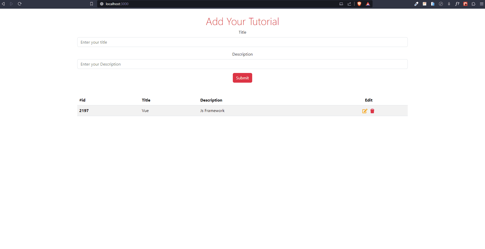
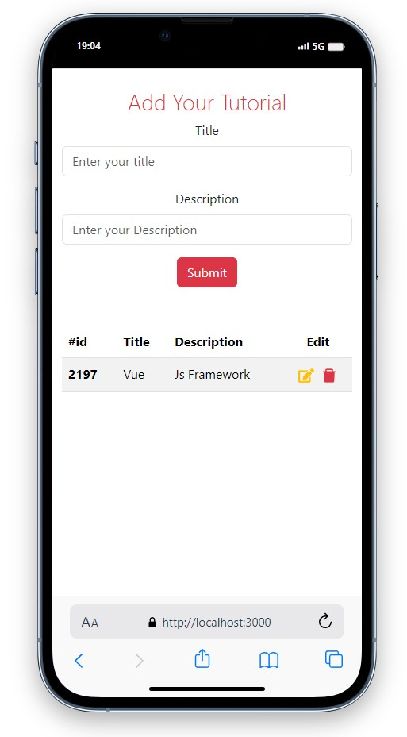
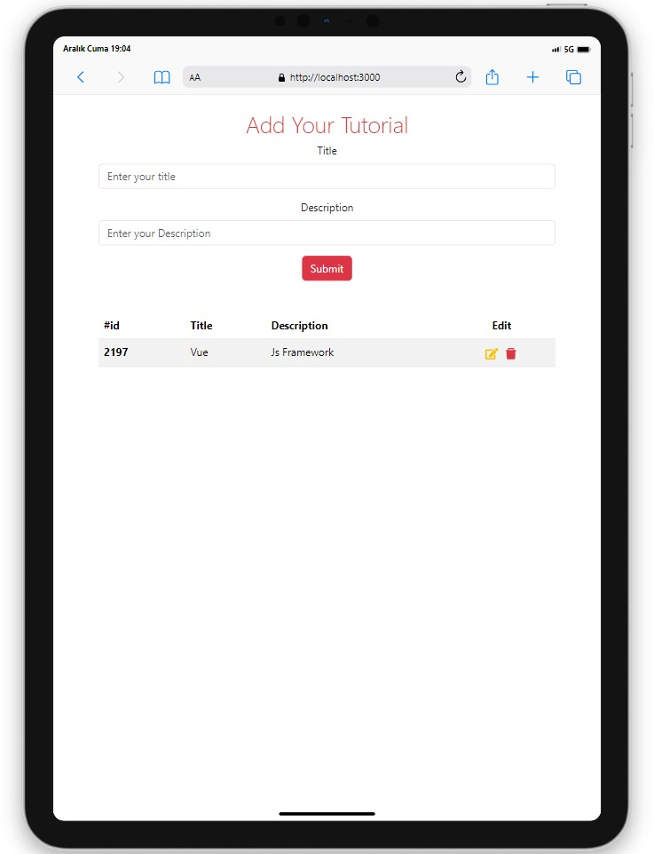
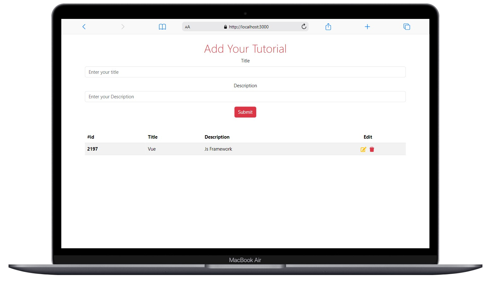

# Tutorial App

<div align="center">
  
</div>

## About the Project

In this project created with React, I have implemented data insertion, data update, and data deletion operations on the API used

## Live Demo

[Tutorial App](https://tutorial-app-seven.vercel.app/)

## Features

- Data is retrieved from the API using the GET operation.
- Data is added to the API by performing a POST operation.
- Data can be deleted from the API by executing a DELETE operation.
- The data in the API can be modified by using the PUT operation.

## Project Skeleton

```
Tutorial App(folder)
|
|----readme.md         
SOLUTION
├── public
│     └── index.html
├── src
│    ├── assets
│    │       └── [images]
│    ├── components
│    │       ├── AddTutorial.jsx
│    │       ├── EditTutorial.jsx  
│    │       └── TutorialList.jsx 
│    ├── pages
│    │       └── Home.jsx        
│    ├── App.js
│    └── index.js
├── package.json
└── yarn.lock
```

## Screenshots

<div align="center">
  
  
  
</div>

## Compatibility

The project is compatible with both wide-screen computers and mobile devices.

## Dependencies

- Bootstrap
- Axios
- React-Icons
